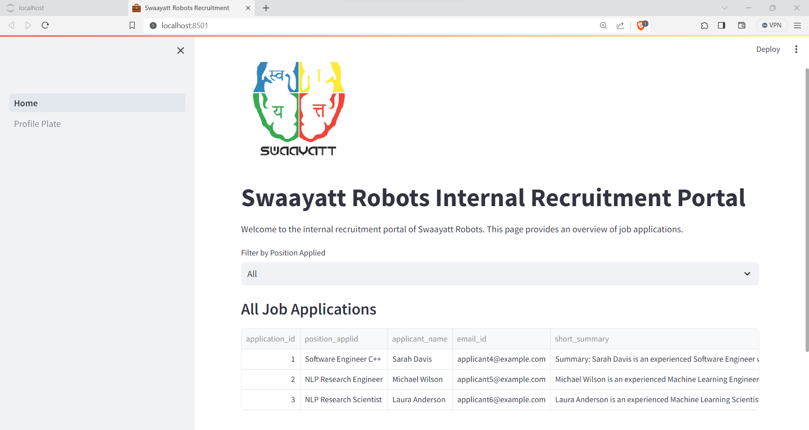

# Automated Candidate Evaluation System

## Overview

This repository contains an automated LLM-based system designed to streamline the process of parsing applicant emails, extracting relevant information from resumes, and generating summaries of each candidate's qualifications. 
- The primary focus is identifying suitable candidates for specific job positions, such as "Software Engineer C++" or "Deep Learning Engineer" by processing the text in both the job description and candidate application mail and resume.
-  The application utilizes cutting-edge technologies, including Extractive question answering using LLM, RAG (Retrieval-Augmented Generation) using LLM, Streamlit, Hugging Face, Python.
-  For a quick view of the working application, skip to the last section of the page, where the working application's screenshots are presented under the `Results` section.

## Objective

- The primary objective of this system is to leverage the existing LLMs (Large Language Models) and quickly identify the most suitable candidates for each job position based on the attached resume. The candidate profile that best matches the job description receives a higher match score.
- The success criteria of the application are defined as follows: the application should be able to identify the position the candidate is applying for from the email application sent to the careers mailbox, generate a concise summary, especially highlighting education and relevant projects/work experience, and generate a score based on the suitability of the candidate to the given job description.

## Application Architecture

The application comprises three main components:

1. **User Interface:** 
    - For the UI, a simple application approach is taken, utilizing Streamlit to integrate the ML application into HTML.

2. **Extracting the Position Applied:**
    - A RoBERTa model trained on the SQuAD dataset is employed for extractive Question-Answering (QA). The model is trained to predict the start and end tokens in the context given the question.

3. **Generating Summary and Score from the Resume:**
    - For summaries and score generation, two Large Language Models (LLMs) are utilized: Mistral 7B and GPT 3.5. These models generate answers given the context, and the Retrieval-Augmented Generation (RAG) concept is employed here to obtain the results.

## Features

### 1. Email Parser

- Parses incoming email applications based on a given prompt (e.g., "Software Engineer C++" or "Deep Learning Engineer").
- Extracts crucial information, including the candidate's name, the job position applied for, and any attached resumes.

### 2. Resume Summarization

- Summarizes the content of extracted resumes to provide concise and relevant information.
- Focuses on the candidate's qualifications, emphasizing education and relevant projects.

### 3. Quality Assessment

- Implements a metric or evaluation criteria to measure the quality of generated summaries.
- Ranks the extracted profiles based on the assessment, aiding in the selection of the most promising candidates.

### 4. Streamlit Interface

- Utilizes the Streamlit framework for a user-friendly and interactive web interface.
- Provides an intuitive platform for users to input prompts, view parsed information, and assess candidate summaries.

## How to Use

1. Clone the repository to your local machine.
2. Install the required dependencies using `pip install -r requirements.txt`.
3. Run the Streamlit app using `streamlit run app.py`.
4. Access the web interface in your browser and follow the instructions to input prompts and evaluate candidate summaries.

   for more details refer the documentation

# Results

 

 

 

