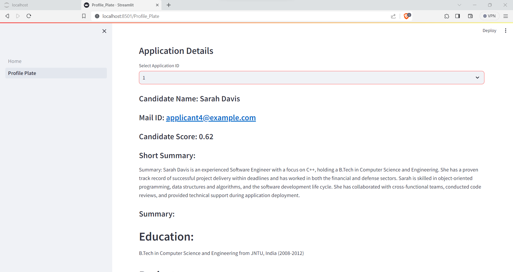

# Automated Candidate Evaluation System

## Overview

This repository contains an automated LLM-based system designed to streamline the process of parsing applicant emails, extracting relevant information from resumes, and generating summaries of each candidate's qualifications. 
- The primary focus is identifying suitable candidates for specific job positions, such as "Software Engineer C++" or "Deep Learning Engineer" by processing the text in both the job description and candidate application mail and resume.
-  The application utilizes cutting-edge technologies, including Extractive question answering using LLM, RAG (Retrieval-Augmented Generation) using LLM, Streamlit, Hugging Face, Python.

## Objective

The primary objective of this system is to automate the extraction and summarization of relevant information from applicant emails, providing a convenient and efficient solution for human resources and recruitment teams. The system aims to enhance both the speed and accuracy of the candidate evaluation process, with a particular emphasis on their education and relevant projects.

## Features

### 1. Email Parser

- Parses incoming email applications based on a given prompt (e.g., "Software Engineer C++" or "Deep Learning Engineer").
- Extracts crucial information, including the candidate's name, the job position applied for, and any attached resumes.

### 2. Resume Summarization

- Summarizes the content of extracted resumes to provide concise and relevant information.
- Focuses on the candidate's qualifications, emphasizing education and relevant projects.

### 3. Quality Assessment

- Implements a metric or evaluation criteria to measure the quality of generated summaries.
- Ranks the extracted profiles based on the assessment, aiding in the selection of the most promising candidates.

### 4. Streamlit Interface

- Utilizes the Streamlit framework for a user-friendly and interactive web interface.
- Provides an intuitive platform for users to input prompts, view parsed information, and assess candidate summaries.

## Implementation

The system is implemented in Python, leveraging powerful libraries and frameworks such as Hugging Face Transformers for BERT and RAG models, PyTorch for machine learning functionalities, and Streamlit for the user interface.

## How to Use

1. Clone the repository to your local machine.
2. Install the required dependencies using `pip install -r requirements.txt`.
3. Run the Streamlit app using `streamlit run app.py`.
4. Access the web interface in your browser and follow the instructions to input prompts and evaluate candidate summaries.

## Future Enhancements

- Integration of additional NLP models for improved summarization.
- Support for a wider range of job positions and prompts.
- Enhanced user customization and configuration options.

Feel free to explore the codebase, provide feedback, and contribute to further improvements. This system represents a powerful tool for automating candidate evaluation, combining state-of-the-art technologies to meet the demands of modern recruitment processes.

# Results

 

 

 

